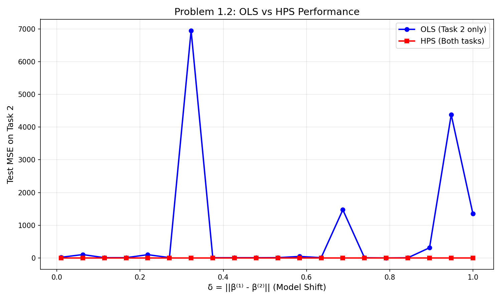
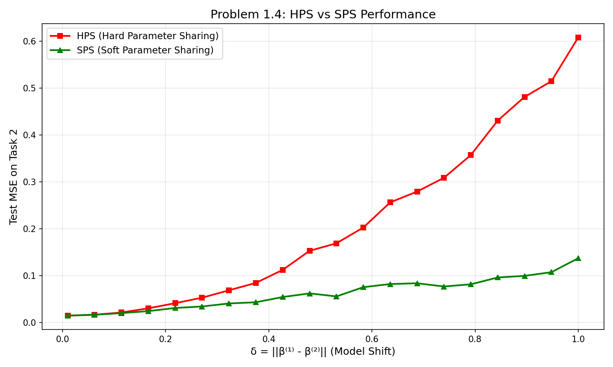
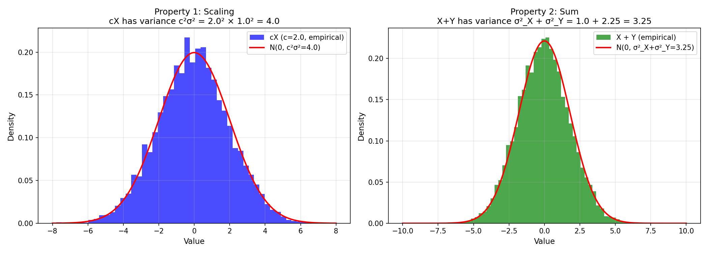
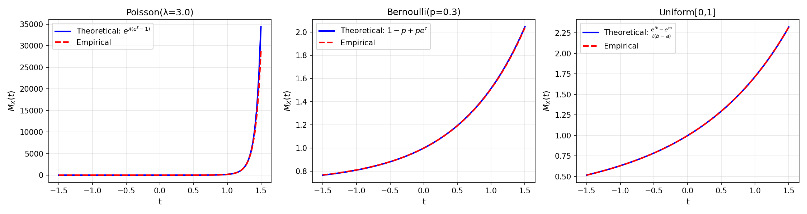

# Transfer Learning and Generalization

A from-scratch implementation and empirical study of transfer learning estimators,
with theoretical analysis of when and why knowledge from a related task improves
performance on a target task. Covers Ordinary Least Squares, Hard Parameter Sharing,
and Soft Parameter Sharing under varying task similarity conditions, validated with
simulation experiments grounded in sub-Gaussian concentration theory.

## The Central Question

When does transferring knowledge from a source task to a target task actually help?

Intuitively, if two tasks are very similar, sharing information should reduce estimation
error. But if the tasks are too different, sharing corrupts the target estimate. This
project studies that tradeoff quantitatively, implementing the estimators from scratch
and verifying that empirical performance matches theoretical bounds.

## Estimators Implemented

### Ordinary Least Squares (OLS)
The single-task baseline. Uses only target task data and makes no assumptions about
any source task. Formula:

```
β̂_OLS = (X^T X)^{-1} X^T y
```

Pros: Unbiased, no assumptions required.
Cons: High variance when target data is scarce. No benefit from related tasks.

### Hard Parameter Sharing (HPS)
Assumes both tasks share the same underlying parameter (`β^(1) = β^(2) = β`) and pools
all data together:

```
minimize (1/(n1+n2)) * [Σ(x_i^(1)^T β - y_i^(1))^2 + Σ(x_j^(2)^T β - y_j^(2))^2]
```

Pros: Dramatic variance reduction when tasks are identical (delta = 0).
Cons: Introduces large bias when tasks differ. "Negative transfer" can make it
      worse than OLS.

### Soft Parameter Sharing (SPS)
A regularized middle ground. Allows `β^(1)` and `β^(2)` to differ, but penalizes
large differences via an L2 regularizer on `z = β^(1) - β^(2)`:

```
minimize (1/(n1+n2)) * [task_1_loss + task_2_loss] + λ * ||z||^2
```

The hyperparameter `λ` controls the tradeoff: `λ → ∞` recovers HPS, `λ = 0` recovers OLS.

**Key insight:** There exists an optimal `λ*` that minimizes expected test loss, and
its value depends on `delta` (task distance) and the ratio `n1/n2`. This project
derives and validates that relationship experimentally.

## Experimental Analysis

### OLS vs HPS: Effect of Task Distance (delta)



When `delta` (the L2 distance between the true parameters of both tasks) is small,
HPS significantly outperforms OLS because pooling is effectively adding more samples
from a nearly-identical distribution. As `delta` grows, HPS degrades due to bias —
and eventually OLS, despite using less data, gives lower test MSE.

**Takeaway:** Hard parameter sharing is only beneficial when tasks are genuinely similar.
This mirrors the real-world failure mode of naive fine-tuning across distant domains.

### HPS vs SPS: Lambda Tuning



SPS with a well-chosen `lambda` outperforms both OLS and HPS across all values of
`delta`. The optimal `lambda` decreases as task distance grows — the regularizer
correctly "loosens its grip" when the tasks are more different.

### Sub-Gaussian Concentration Validation



A key theoretical tool in learning theory is the sub-Gaussian tail bound:
for a sub-Gaussian random variable X with parameter sigma:

```
P(|X| > t) ≤ 2 * exp(-t^2 / (2 * sigma^2))
```

This project validates the bound empirically by simulating large ensembles and
measuring tail probabilities against the theoretical prediction. It also validates
the sum-of-sub-Gaussians property: the sum of independent sub-Gaussian variables
remains sub-Gaussian with variance that adds.

### MGF Analysis



The moment generating function (MGF) characterization is equivalent to the tail bound.
Simulations verify that empirical MGFs stay below the Gaussian MGF envelope, confirming
the sub-Gaussian structure of the constructed distributions.

## Neural Network Extension

The `neural_network.py` module implements a two-layer fully-connected network trained
on MNIST using PyTorch to study how the same tradeoffs appear in deep learning:

- Does pre-training on a related vision task help when target data is scarce?
- How does the hidden layer size affect the bias-variance tradeoff?
- Can we observe the same delta-sensitivity phenomenon in neural networks?

```python
class TwoLayerNN(nn.Module):
    def __init__(self, input_dim, hidden_dim, output_dim):
        # fc1 -> ReLU -> fc2
```

## Theoretical Background

This project sits at the intersection of:

- **Statistical learning theory** — PAC learning, generalization bounds, bias-variance
- **Transfer learning** — domain adaptation, multi-task learning
- **Concentration inequalities** — sub-Gaussian, Hoeffding, Bernstein bounds

The key theoretical result is an upper bound on the excess risk of HPS and SPS
in terms of `delta`, `n1`, `n2`, and `p` (feature dimension). SPS achieves a
minimax-optimal rate when lambda is chosen correctly.

## Setup

```bash
pip install numpy scipy matplotlib scikit-learn torch torchvision
python estimators.py        # runs OLS / HPS / SPS comparison experiments
python transfer_experiments.py  # runs conditioned covariate experiments
python neural_network.py    # trains two-layer NN on MNIST
```

## Files

| File | Description |
|------|-------------|
| `estimators.py` | OLS, HPS, SPS implementations + simulation experiments |
| `transfer_experiments.py` | Conditioned covariate transfer experiments |
| `neural_network.py` | Two-layer neural network for MNIST |
| `hw1_p1_part2_ols_vs_hps.png` | OLS vs HPS across delta values |
| `hw1_p1_part4_hps_vs_sps.png` | HPS vs SPS across lambda values |
| `hw1_p2_subgaussian.png` | Sub-Gaussian concentration validation |
| `hw1_p3_mgf.png` | MGF envelope validation |

## Technologies

Python · NumPy · PyTorch · SciPy · Matplotlib · Statistical Learning Theory
